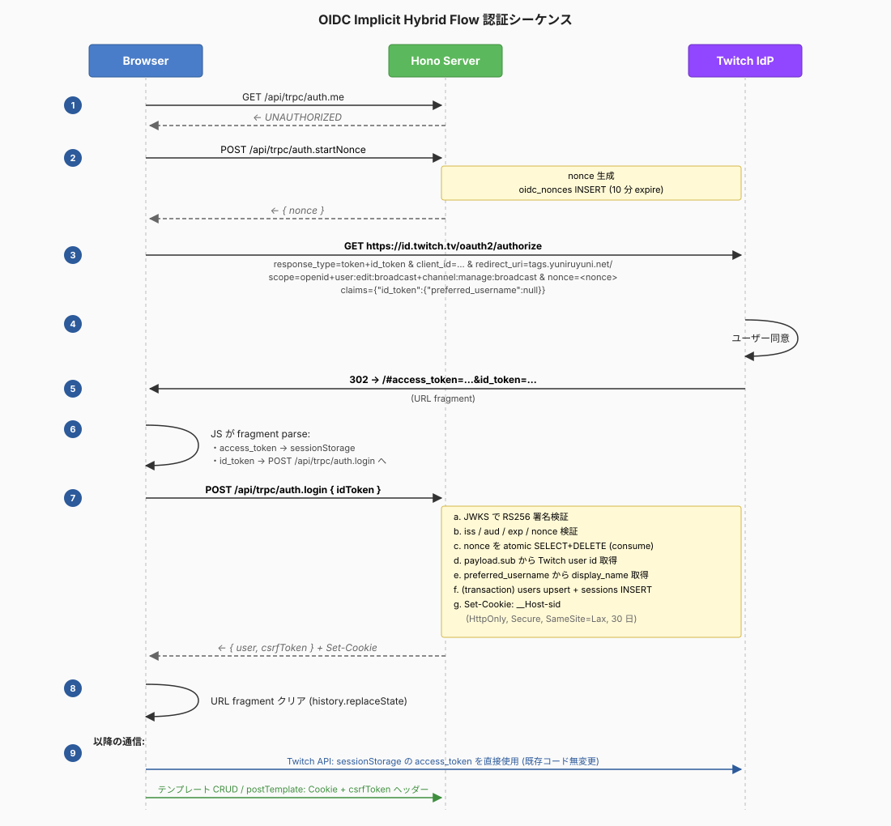

# Twitch OIDC 認証 + テンプレート サーバー保存 — オーバービュー

このディレクトリは「Twitch OIDC 認証導入 + テンプレートのサーバー保存」機能を 8 PR に分割した実装計画。各 PR ドキュメント (`01-*.md` 〜 `08-*.md`) は単独で読んでも作業着手できるよう書かれているが、共通する設計・規約・セキュリティモデルは本ファイルに集約する。

各 PR ドキュメントから本ファイルを参照すること。

---

## プロジェクトの背景

StreamTagInventory は Twitch 配信者向けのカテゴリ・タグ管理ツール。テンプレートを事前作成し、ワンクリックで配信設定を適用できる。**現状はテンプレートをブラウザの localStorage に保管しており、複数端末で共有できない**。本シリーズはこの問題を解決する。

### 現状認識
- Twitch **OAuth Implicit Flow** (`response_type=token`) で client が access_token を直接取得 → **sessionStorage** (`"twitch-auth"`) に保管
- `client/src/api/twitch.ts` 経由で client が直接 `api.twitch.tv/helix/*` を呼出
- Backend は完全に空 (`Repos = {}`, `appRouter = router({})`)、認証ライブラリ皆無、`schema/tables/` は `.gitkeep` のみ
- 本番 URL: **`https://tags.yuniruyuni.net/`** (Cloudflare 経由)

### ゴール
1. id_token ベースで Twitch ユーザーをサーバ側で identity 識別
2. テンプレート / postTemplate をユーザー単位で DB 永続化、複数端末共有
3. 既存の Twitch API 呼出コードは **無変更** (現状動作を極力変えない最小変更案)
4. 既存 localStorage は破壊しない (明示移行 Modal)

---

## 採用フロー: OIDC Implicit Hybrid Flow + Stateless JWT Bearer (ADR 0007)

`response_type=token id_token` を使い、access_token と id_token を **同時取得**:

- **access_token**: 従来通り client の sessionStorage に保管、Twitch API 直接呼出に使用
- **id_token**: client が sessionStorage に保管し、`Authorization: Bearer <id_token>` で **毎リクエスト送信**。サーバはリクエストごとに `jose.jwtVerify` で署名 / iss / aud / exp を検証し、`sub` から users 表を find-or-create して identity を resolve する
- サーバは Twitch トークン (access / refresh) に **一切触れない・保持しない・転送しない**
- サーバはユーザーごとの Y.Doc を DB に保存し sync API を提供
- **サーバー側に session / nonce 表は持たない** (ADR 0007)。replay 防止は client 側で nonce を生成して id_token claim と照合することで担保

### 認証シーケンス図



> シーケンス図は ADR 0006 時点のまま (server 側 login mutation を含む) で未更新。テキスト記述が正。

### 「触れる」もの / 「触れない」もの

| 種類 | サーバが見る | DB 保存 |
|---|---|---|
| `id_token` (JWT, ~1時間有効) | ✅ 毎リクエスト署名検証 | ❌ |
| Twitch `access_token` | ❌ | ❌ |
| Twitch `refresh_token` | ❌ (Implicit Hybrid は発行しない) | ❌ |
| Twitch user id (`sub`) | ✅ | ✅ `users.twitch_user_id` |
| OIDC nonce | ❌ (client local) | ❌ |
| テンプレート / postTemplate | ✅ Y.Doc バイナリの sync のみ | ✅ `template_docs` (Yjs CRDT、1 ユーザー 1 行) |

→ **サーバ DB が漏洩しても Twitch アカウント侵害につながらない**。さらに ADR 0007 によりサーバー側に長寿命の session credential が存在しないため、漏洩時の悪用面も狭い。

テンプレートおよびユーザー設定 (postTemplate) は [ADR 0004](../adr/0004-local-first-sync-with-yjs.md) により Yjs CRDT に統合され、1 ユーザー 1 Y.Doc (= DB 上 1 行の BYTEA) に集約される。サーバは中身の構造を直接クエリせず、state の読み書きと shape / サイズ検証のみを行う。

---

## セキュリティモデル

| 脅威 | 対策 |
|---|---|
| XSS による Twitch トークン窃取 | sessionStorage 保管継続のため現状と同水準のリスクが残る (受容) |
| XSS による id_token 窃取 | id_token も sessionStorage 保管 (access_token と同等の XSS リスク、ADR 0007)。漏洩時は `exp` (~1h) まで replay 可能 |
| CSRF | **CSRF 固有対策は不要**。id_token は `Authorization: Bearer` で手動送信 = browser が cross-site で自動付与しない (ADR 0006/0007) |
| id_token 改ざん | jose による RS256 + JWKS 検証、iss/aud/exp 全検証 (毎リクエスト) |
| リプレイ攻撃 (id_token 再利用) | id_token の `exp` (Twitch 既定 ~1h) を超えたら自動失効。client は受領時に nonce claim と stored nonce を照合し mix-up を防ぐ。サーバー側 nonce DB consume は ADR 0007 で廃止 |
| 即時セッション無効化 | **不可** (ADR 0007 で受容)。個人配信者向けで運用要件無し。緊急時は Twitch app 側で client_id を再発行する運用に倒す |
| オープンリダイレクト | Twitch app 事前登録済 URL のみ受付、サーバ側で `redirect_to` 受付なし |
| DB injection | 既存 `sql` タグ + プレースホルダーで完全防御済 |
| タイミング攻撃 | nonce 比較は client の文字列等価で十分 (server 側比較は不要) |
| ログ漏洩 | logger は `id_token` / `access_token` を出力禁止 |
| 中間 CDN (Cloudflare) によるユーザー情報露呈 | アプリ層 `Cache-Control: no-store` + Cloudflare Cache Rule で `/api/*` Bypass、`Vary: Authorization` で保険 |
| サーバ DB 漏洩時の Twitch アカウント連鎖 | **設計上排除** — DB に Twitch トークンを一切持たない |
| サーバ DB 漏洩時の session なりすまし | **設計上排除** — DB に session credential を持たない (ADR 0007) |
| ドメイン乗っ取り (active phishing / passive theft) | 防御不可能 (受容)。運用層で Redirect URL 厳格化 + ユーザー教育 |

### 受容するリスクと根拠
- **即時 revoke 不能** を受容する代わりに、サーバー側の session 状態管理を全廃して race / 状態管理コードを大幅削減 (ADR 0007)
- **id_token の XSS exfiltrate** は access_token と同水準のリスク。後者は元々 sessionStorage 露出 (ADR 0002) なので実効的な regression なし
- **Passive theft (ドメイン乗っ取り時のみ)** を受容する代わりに、実装複雑度・レイテンシ・サーバ侵害時の攻撃面拡大を回避

---

## DB スキーマ概要

`schema/tables/` 配下に **2 ファイル** (ADR 0007 で sessions / oidc_nonces を撤去):

- `01_users.sql` — Twitch user id ↔ 内部 UUID マッピング
- `template_docs.sql` — ユーザーごとの Y.Doc バイナリ (テンプレート配列と postTemplate を同居) 。1 ユーザー 1 行

**oauth_tokens / oauth_states テーブルは作らない** — サーバが Twitch トークンを保持しないため。
**`templates` / `user_settings` テーブルは作らない** — ADR 0004 により Y.Doc に統合されたため。
**`sessions` / `oidc_nonces` テーブルは作らない** — ADR 0007 により stateless JWT bearer 化、サーバー側 session 状態を持たない。

---

## アーキテクチャ規約

**必ず [`../architecture.md`](../architecture.md) を読むこと**。以下の規約がまとめられている:

- Layer 構成 (Model / Repository / Usecase / Presentation) と依存方向
- **Repository 標準メソッド**: `get(ctx, spec)` / `list(ctx, spec, cursor)` / `count(ctx, spec)` / `upsert(ctx, model)` / `delete(ctx, spec)` のみ。**`findByXxx` / `listByXxx` は禁止**
- **Spec 規約**: `models/<entity>/index.ts` の namespace で `defineSpecs({ ByXxx, ... })` を定義、`Comp<T>` で AND/OR/NOT 合成
- **Pagination**: `Cursor<T>` / `Sort<T>` / `Page<T>` 型。全 list クエリは cursor ベース、必ず `id` を tiebreaker として sortKey 末尾に含める
- **Usecase phase**: `pre → read → process → write → post → result` の 6 phase、`read → process → write` は 1 トランザクション
- **能力マーカー**: `DbReadCtx` / `DbWriteCtx` / `ServiceCtx`
- **Result / Fail**: 例外を投げず `Result<T, Fail>` で返す。`fail("CODE", "message", details?)`

本プラン群で新規に書く Repository / Usecase / Model は上記規約に厳密に従う。「`findById` を書きたい」と感じたら spec を追加するべきサイン。

### 本プロジェクト固有の既存パターン

- **SQL ビルダー** (`server/src/infra/db/sql.ts`): `sql\`SELECT * FROM users WHERE id = ${id}\`` のタグ付きテンプレート。`sql.join` / `sql.raw` / `sql.list` / `sql.empty` のヘルパー
- **ID 生成**: `server/src/models/common/id.ts` の `generateId()` (UUID v4)
- **tRPC エラー変換**: `server/src/presentation/trpc/handle-result.ts` の `handleResult()` で `Result<T, Fail>` → `TRPCError`

---

## 技術スタック

- Runtime: **Bun** (workspaces: `client`, `server`, `e2e`)
- Frontend: React 19 + TypeScript + Tailwind CSS v4
- Backend: Hono + tRPC + PostgreSQL
- Linting: Biome (`biome.jsonc`)
- Testing: bun:test (unit), Playwright (e2e)
- DB Migration: pgschema (declarative)
- Deploy: Docker (distroless) → Cloud Run

### 主要コマンド
```bash
bun run watch:run     # 開発サーバー起動
bun run build         # プロダクションビルド
bun run check         # type + lint + test 並列実行
bun run check:type    # TypeScript 型チェック
bun run check:lint    # Biome lint
bun run check:test    # ユニットテスト
bun run check:e2e     # Playwright e2e テスト
bun run fix:lint      # Biome auto-fix
```

各 PR の完了時に `bun run check` を緑のまま積み上げること。

---

## 依存関係マップ (PR 順序)

```
PR 1 (DB schema + env)
  ↓
PR 2 (Repository 層)
  ↓
PR 3 (Twitch JWKS + auth ユースケース)  ← jose 追加
  ↓
PR 4 (tRPC + middleware + auth ルーター)
  ↓
PR 5 (Y.Doc sync ルーター)            ← yjs 追加
  ↓                                ↘
PR 6 (Frontend tRPC + auth provider)  ← 独立して並行可
  ↓
PR 7 (Y.Doc プロバイダ + CRDT 化 + 移行 UI)  ← yjs / y-indexeddb 追加
  ↓
PR 8 (E2E + secrets + docs + cleanup)
```

PR 6 は PR 5 完了時点で着手可能 (PR 5 の AppRouter 型を参照する)。

---

## 環境変数規約

### Server
- `TWITCH_CLIENT_ID`: id_token の `aud` 検証用 (本番は Cloud Run Secret Manager)
- `APP_BASE_URL`: 自身の base URL (CORS / redirect 検証用)、本番 `https://tags.yuniruyuni.net`、開発 `http://localhost:3000`

### Client (build 時埋込)
- `BUN_PUBLIC_TWITCH_CLIENT_ID`: Twitch OAuth authorize URL 構築用
- `BUN_PUBLIC_APP_BASE_URL`: redirect_uri 構築用

### Cloud Run シークレット命名 (CLAUDE.md 規約)
- 本シリーズで新規追加する secret は **無し**
- 既存: `stream-tag-inventory-db-password`, `stream-tag-inventory-db-app-password`, `cf-db-access-client-id`, `cf-db-access-client-secret`
- `TWITCH_CLIENT_ID` は OAuth の仕様上公開値 (client bundle / authorize URL に出る) のため `cloudrun.yaml` に平文 value で埋める。secret manager は使わない

---

## Cloud Run デプロイの落とし穴 (CLAUDE.md より重要事項)

実装で触れる際に再発させないこと:

1. **命名の一貫性**: `deploy.yml` の `env.SERVICE_NAME` / `cloudrun.yaml` の `metadata.name` / `cloudrun-job.yaml` の `metadata.name` は 3 箇所同時変更
2. **memory の最低要件**: gen2 実行環境は合計 512Mi 以上必須
3. **`PORT` 環境変数**: Cloud Run の予約環境変数。`cloudrun.yaml` の `env` に追加してはいけない
4. **DB パスワードの使い分け**: migration job は owner (`stream-tag-inventory-db-password`)、service は app user (`stream-tag-inventory-db-app-password`)
5. **cloudflared サイドカー**: `cloudrun.yaml` と `cloudrun-job.yaml` 両方に必要

---

## 用語集

| 用語 | 意味 |
|---|---|
| **id_token** | OIDC で発行される JWT。Twitch user identity の証明書。`sub`, `iss`, `aud`, `exp`, `nonce` claim を含む。ADR 0007 でサーバー認証の bearer credential として毎リクエスト送信する |
| **access_token** | Twitch API 呼出用 bearer token。client が sessionStorage に保管、サーバは触れない |
| **JWKS** | JSON Web Key Set。Twitch の公開鍵集合。`https://id.twitch.tv/oauth2/keys` |
| **nonce** | id_token mix-up 防止のためのワンタイム値。ADR 0007 で **client が生成**し、authorize URL に埋込み、callback で id_token の `nonce` claim と照合する |
| **PKCE** | Proof Key for Code Exchange。本案では Implicit Hybrid Flow を使うため不要 |
| **CSRF token** | 〔ADR 0006 で廃止〕Bearer 認証は browser が cross-site で自動送信しないため CSRF 固有対策は不要 |
| **`__Host-` prefix** | 〔ADR 0006 / 0007 で廃止〕Cookie を使わないため不要 |
| **fractional indexing** | 〔ADR 0003 で採用 → ADR 0004 で撤廃〕テンプレート並び替えで前後の position の中間値を割り当てる手法。本プロジェクトでは Y.Array に置き換わり未使用 |
| **CRDT** | Conflict-free Replicated Data Type。並行編集が自動収束するデータ型の総称。本プロジェクトでは Yjs を使う |
| **Y.Doc / Y.Array / Y.Map** | Yjs の CRDT プリミティブ。テンプレートは Y.Doc 内の `Y.Array<Y.Map>`、postTemplate は `Y.Map` の string フィールドで保持 |
| **state vector** | Yjs の同期プロトコルで交換される「各クライアントが持っている update の集合」の要約。差分計算に使う |
| **y-indexeddb** | Y.Doc をブラウザの IndexedDB に永続化する Yjs 純正プロバイダ。オフライン対応・複数タブ同期を担う |
| **DbReadCtx / DbWriteCtx / ServiceCtx** | リポジトリメソッドのスコープ制御マーカー (能力マーカー) |
